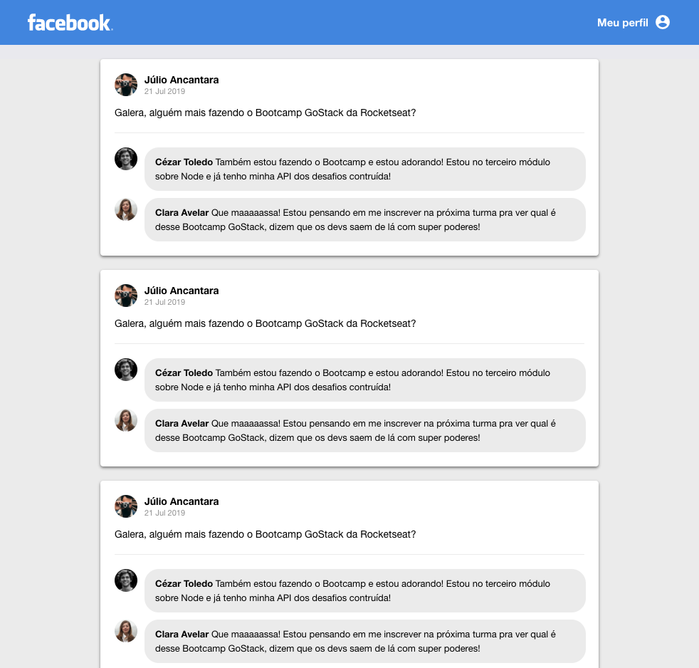

<h1 align="center">
     
    <br>
    Facebook Clone ReactJS
</h1>

This is a simple app created with during [Rocketseat Bootcamp](https://rocketseat.com.br/bootcamp) in order to train how to start a ReactJS application from scratch, installing all the necessary libraries and rendering on the screen a simple facebook page template.

The information from this project is static and is not comming from an API. The objective here is just to show how to start a ReactJS application, creating the components and passing the parameters as props.

This is the template generated by this app:



## :rocket: Installation

Clone the repository

```bash
git clone https://github.com/giovanniantonaccio/facebook-clone-reactjs.git
```

Install the dependencies:

```bash
yarn
```

Run the following command to run the server:

```bash
yarn dev
```

## :books: Technologies

This project was developed with the following technologies:

- [ReactJS](https://reactjs.org/)
- [Babel](https://babeljs.io/)
- [Webpack](https://webpack.js.org/)
- [VS Code](https://code.visualstudio.com/)

## :memo: License

This project is under the MIT license. See the [LICENSE](https://github.com/giovanniantonaccio/facebook-clone-reactjs/blob/master/LICENSE) for more information.

---

Made by Giovanni Antonaccio :wave: [Get in touch!](https://www.linkedin.com/in/giovanniantonaccio/)
